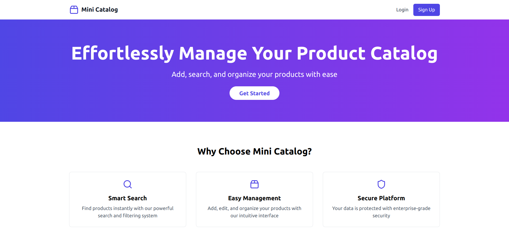

# Product Catalog Service

A simple web application where users can manage their products or services. The app includes user authentication and allows users to add, view, edit, and delete products/services.



## Features

- **User Authentication**: Login and signup functionality.
- **Product Management**:
  - Add, view, edit, and delete products/services.
- **Search**: Find products by name, category, or price range.
- **Responsive Design**: User-friendly UI.

## Tech Stack

- **Frontend**: React (TailwindCSS or Material-UI)
- **Backend**: Flask (Python) with SQLite
- **Authentication**: JWT or session-based
- **API Communication**: RESTful API

## Folder Structure

```
product-catalog-service/
├── backend/          # Flask backend with API endpoints
├── frontend/         # React frontend
├── README.md         # Main repository README
└── LICENSE           # License file
```

## Setup Instructions

1. **Clone the Repository**
   ```sh
   git clone https://github.com/your-username/product-catalog-service.git
   cd product-catalog-service
   ```

2. **Setup the Backend**
   - Follow instructions in [`backend/README.md`](backend/README.md).

3. **Setup the Frontend**
   - Follow instructions in [`frontend/README.md`](frontend/README.md).

4. **Run the App**
   - Start backend and frontend, then open `http://localhost:3000`.

