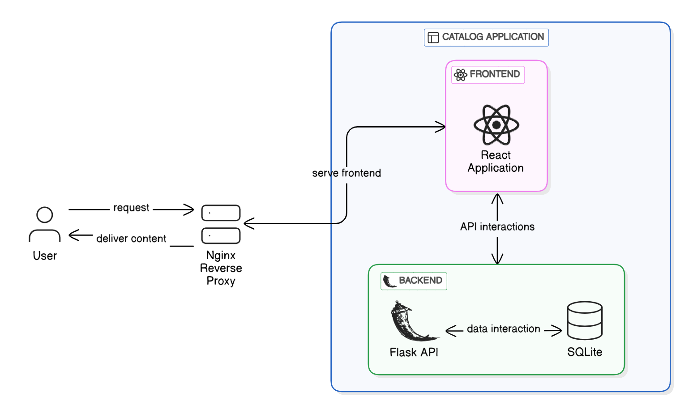

# Product Catalog Service  

A full-stack web application where users can manage their products or services. The app includes user authentication and allows users to add, view, edit, and delete products/services. This project also includes an **Nginx reverse proxy server** to route traffic efficiently between the frontend and backend.  


## Architecture 



## Features  

- **User Authentication**: Login and signup functionality.  
- **Product Management**:  
  - Add, view, edit, and delete products/services.  
- **Search**: Find products by name, category, or price range.  
- **Responsive Design**: User-friendly UI.  
- **Nginx Reverse Proxy**: Routes traffic between the React frontend and Flask backend.  

  

## Tech Stack  

- **Frontend**: React (TailwindCSS or Material-UI)  
- **Backend**: Flask (Python) with SQLite  
- **Authentication**: JWT or session-based  
- **API Communication**: RESTful API  
- **Reverse Proxy**: Nginx  


## Folder Structure

```
product-catalog-service/
├── nginx/            # Nginx reverse proxy configuration
├── backend/          # Flask backend with API endpoints
├── frontend/         # React frontend
├── README.md         # Main repository README
└── LICENSE           # License file
```

## Setup Instructions

1. **Clone the Repository**
   ```sh
   git clone https://github.com/your-username/product-catalog-service.git
   cd product-catalog-service
   ```

### 2. Setup the Backend  
- Follow instructions in [`backend/README.md`](backend/README.md).  

### 3. Setup the Frontend  
- Follow instructions in [`frontend/README.md`](frontend/README.md).  

### 4. Setup the Nginx Reverse Proxy  
- Follow instructions in [`nginx/README.md`](nginx/README.md).  

### 5. Run the Application  
- Start the backend and frontend services.  
- Ensure Nginx is running to proxy requests correctly.  
- Access the app at `http://your-server-ip-or-domain`.  

