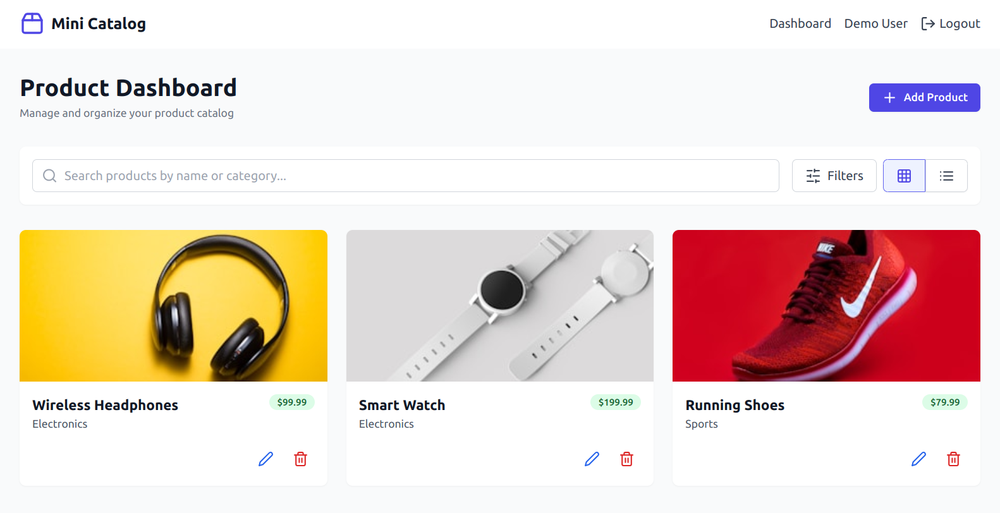

# Product Catalog Service

A simple web application where users can manage their products or services. The app includes user authentication and allows users to add, view, edit, and delete products/services.

## Features

- **User Authentication**: Simple login and signup functionality.
- **Product Management**:
  - Add new products/services.
  - View, edit, and delete existing products/services.
- **Search**: Search for products by name, category, or price range.
- **Responsive Design**: Modern frontend with a clean and user-friendly interface.

## Tech Stack

- **Frontend**: React (with TailwindCSS or Material-UI for styling)
- **Backend**: Flask (Python) with SQLite for database
- **Authentication**: JWT-based or session-based (mocked or integrated)
- **API Communication**: RESTful API using `axios` or `fetch`

## Folder Structure

```
product-catalog-service/
├── backend/          # Flask backend with API endpoints and SQLite database
│   ├── app.py        # Main Flask application
│   ├── models.py     # Database models
│   └── requirements.txt # Python dependencies
├── frontend/         # React frontend
│   ├── src/          # React source code
│   │   ├── components/ # Reusable components
│   │   ├── pages/    # Pages like Login, Dashboard, etc.
│   │   └── App.js    # Main React application
│   └── package.json  # Node.js dependencies
└── README.md         # This file
```

## Setup Instructions

### Prerequisites

- Python 3.x
- Node.js 16+ and npm
- SQLite (optional, as Flask uses it by default)

### Backend Setup

1. Navigate to the `backend` folder:
   ```bash
   cd backend
   ```
2. Install Python dependencies:
   ```bash
   pip install -r requirements.txt
   ```
3. Run the Flask server:
   ```bash
   python app.py
   ```
   The backend will start on `http://localhost:5000`.

### Frontend Setup

1. Navigate to the `frontend` folder:
   ```bash
   cd frontend
   ```
2. Install Node.js dependencies:
   ```bash
   npm install
   ```
3. Start the React development server:
   ```bash
   npm start
   ```
   The frontend will start on `http://localhost:3000`.

### Running the App

- Access the app at `http://localhost:3000`.
- Use the login/signup forms to authenticate and access the dashboard.

## API Endpoints (Backend)

| Method | Endpoint         | Description                |
| ------ | ---------------- | -------------------------- |
| POST   | `/auth/login`    | Authenticate user          |
| POST   | `/auth/signup`   | Register a new user        |
| GET    | `/products`      | Fetch all products         |
| POST   | `/products`      | Add a new product          |
| PUT    | `/products/<id>` | Update an existing product |
| DELETE | `/products/<id>` | Delete a product           |

## Screenshots

### Homepage


### User Dashboard



_(Replace the image paths with actual screenshots if available.)_

## Future Improvements

- Add pagination for large catalogs.
- Include advanced search filters (e.g., date ranges, tags).
- Implement role-based access control (Admin/User).
- Enhance UI/UX with animations and better error handling.

## License

This project is licensed under the MIT License. See the [LICENSE](LICENSE) file for details.
