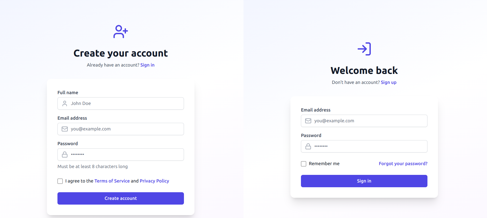
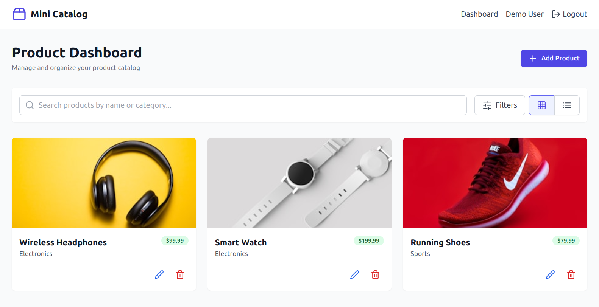

# Product Catalog Service - Frontend

This is the React-based frontend for the Product Catalog Service. It provides user authentication and product management features.

## Features

- User authentication (Login/Signup)
- Product listing, search, add, update, and delete functionalities
- Responsive UI

## Screenshoots
  



## Tech Stack

- **React**: Frontend framework
- **TailwindCSS / Material-UI**: Styling
- **Axios**: API calls

## Setup Instructions

### Prerequisites
- Node.js 16+
- npm or yarn

### Installation

1. **Navigate to the frontend folder**
   ```sh
   cd frontend
   ```

2. **Install dependencies**
   ```sh
   npm install
   ```

3. **Run the development server**
   ```sh
   npm start
   ```
   The app will be available at `http://localhost:3000`.

### Environment Variables

Create a `.env` file in `frontend/` and add:
```
REACT_APP_API_BASE_URL=http://localhost:5000
