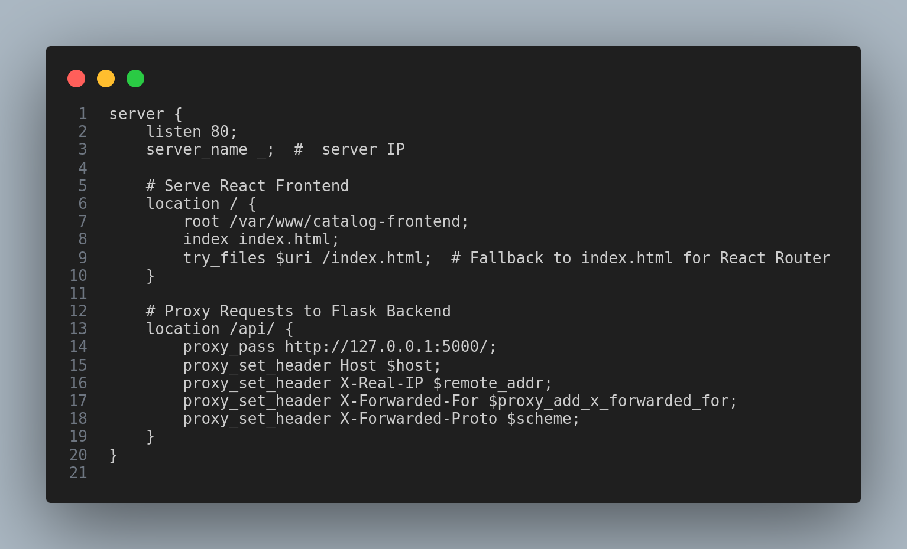

# Nginx Reverse Proxy Setup for Catalog-Fullstack**  

This guide will help you set up **Nginx as a reverse proxy** for your **Catalog-Fullstack** project. The reverse proxy directs requests to the appropriate backend service.  

---

## Install Nginx

If Nginx is not installed, install it using:  
```sh
sudo apt update
sudo apt install nginx -y
```
Once installed, check the status:  
```sh
sudo systemctl status nginx
```

---

## Set Up Your Frontend Directory
Ensure your frontend build files are in `/var/www/catalog-frontend/`

```sh
cd frontend
npm run build
sudo cp -r dist/* /var/www/catalog-frontend  
ls /var/www/catalog-frontend
```

You should see:  
```
assets  index.html
```

---

## **📌 Step 3: Create Nginx Configuration**  

1. Open a new Nginx configuration file:  
   ```sh
   sudo nano /etc/nginx/sites-available/catalog
   ```

2. Add the following configuration:  
    

---

## **📌 Step 4: Enable the Configuration**  

1. Create a symbolic link to enable the site:  

   ```sh
   sudo ln -s /etc/nginx/sites-available/catalog /etc/nginx/sites-enabled/
   ```

2. Test the Nginx configuration:  

   ```sh
   sudo nginx -t
   ```

3. Restart Nginx to apply changes: 
 
   ```sh
   sudo systemctl reload nginx
   ```

---

## **📌 Step 5: Verify the Setup**  

- Visit **`http://your-server-ip/`** → You should see the frontend.  
- Visit **`http://your-server-ip/api/products`** → Should fetch data from the backend.  

---

Now, your **Catalog-Fullstack** app is running with **Nginx as a reverse proxy**! 🚀
